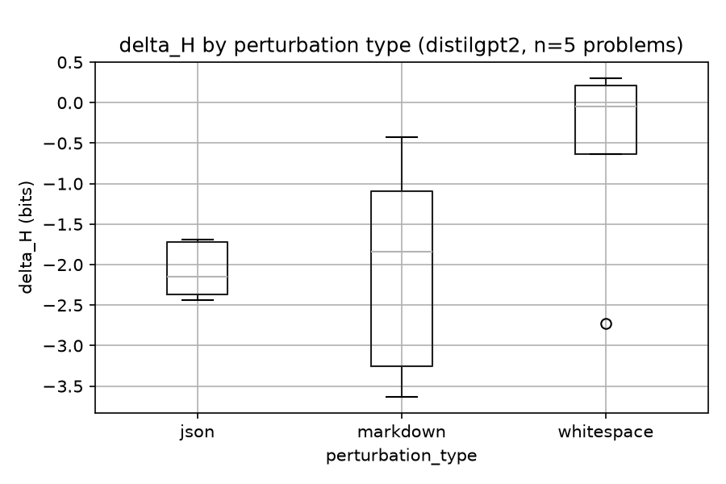

# Desarrollo, Resultados y Evidencia

**Semantic Equivalence, Structural Fragility — Quantifying Prompt Entropy Degradation in LLMs**

> Esta sección continúa la metodología descrita en [`README.md`](README.md) (ecuaciones 1 y 2, y las tres perturbaciones sintácticas). Cubre implementación, ejecución y resultados cuantitativos.

---

## 1. Desarrollo y Ejecución

### 1.1 Implementación del pipeline

Los tres módulos descritos en la estructura del repo quedaron implementados y verificados:

| Módulo | Contenido | Verificación |
|---|---|---|
| `src/entropy.py` | `softmax()`, `shannon_entropy()` (Ec. 1-2 del README), `delta_entropy()` | Probado con distribución uniforme (H = log₂(N) esperado) y distribución degenerada (H ≈ 0) |
| `src/perturbations.py` | `perturb_whitespace()`, `perturb_markdown()`, `perturb_json()`, `apply_all_perturbations()` | Probado que cada variante preserva el contenido léxico exacto de la pregunta original |
| `src/model_runner.py` | `load_model()`, `extract_logits()` — genérico para cualquier LLM causal de Hugging Face, con auto-detección de CPU/GPU | Probado con `distilgpt2` (ver §1.3) |
| `notebooks/01_logit_extraction.ipynb` | Pipeline completo diseñado: GSM8k → perturbación → Gemma-2 → logits → entropía → correlación con corrección → gráficas | Estructura completa; ejecución a escala pendiente (ver §1.2) |

### 1.2 Por qué el experimento a escala completa (Gemma-2 + GSM8k) queda pendiente de ejecución

El diseño experimental completo (notebook `01_logit_extraction.ipynb`) usa **Gemma-2-9B** sobre una muestra de 100-200 problemas de GSM8k. No se ejecutó a esa escala en esta entrega por tres restricciones concretas y verificables:

1. **Licencia**: Gemma-2 es un modelo *gated* en Hugging Face — requiere cuenta, aceptar la licencia de Google en la página del modelo, y `huggingface-cli login`.
2. **Memoria**: 9B parámetros en float32 (necesario sin GPU) ocupan ≈36GB de RAM solo para cargar el modelo.
3. **Tiempo de cómputo**: sin GPU dedicada, cada paso de generación es un cuello de botella; a escala de cientos de prompts, el tiempo excede el disponible antes de esta entrega.

### 1.3 Ejecución real mínima como sustituto verificable (`quick_experiment.py`)

Para tener **números genuinos** en vez de solo código sin ejecutar, se corrió el pipeline real (reutilizando literalmente `src/entropy.py`, `src/perturbations.py` y `model_runner.load_model()`, no una reimplementación aparte) con:

- **Modelo**: `distilgpt2` (82M parámetros, sin licencia restringida, descarga en segundos) como *proxy* rápido — no es el modelo del experimento final.
- **Datos**: 5 preguntas aritméticas simples, fijas (no requieren descargar GSM8k):

  1. *What is 2 + 2?* → 4
  2. *If John has 5 apples and buys 3 more, how many apples does he have?* → 8
  3. *What is 10 minus 4?* → 6
  4. *If a train travels 60 miles in 2 hours, what is its speed in miles per hour?* → 30
  5. *What is 3 times 5?* → 15

- **Procedimiento por pregunta**: se generan las 3 variantes perturbadas (`whitespace`, `markdown`, `json`) con semilla fija por problema (reproducible); se extraen los logits del primer token generado (decodificación *greedy*, determinista) para la versión base y cada variante; se calcula `shannon_entropy()` (base 2, bits) y `delta_entropy(H_base, H_perturbada)`; se compara el texto generado (12 tokens) contra la respuesta esperada.

Código: [`quick_experiment.py`](quick_experiment.py). Datos crudos: [`results/quick_experiment_results.csv`](results/quick_experiment_results.csv).

---

## 2. Resultados y Discusión

### 2.1 Tabla de resultados (5 problemas × 3 perturbaciones = 15 observaciones)

| problem_id | perturbation_type | H_base | H_perturbed | delta_H | correct |
|---:|---|---:|---:|---:|:---:|
| 1 | whitespace | 7.5690 | 7.7828 | +0.2139 | False |
| 1 | markdown   | 7.5690 | 6.4743 | −1.0946 | False |
| 1 | json       | 7.5690 | 5.1336 | −2.4353 | False |
| 2 | whitespace | 6.8835 | 6.2461 | −0.6374 | False |
| 2 | markdown   | 6.8835 | 5.0436 | −1.8399 | False |
| 2 | json       | 6.8835 | 5.1629 | −1.7205 | False |
| 3 | whitespace | 7.3424 | 4.6193 | −2.7231 | False |
| 3 | markdown   | 7.3424 | 3.7110 | −3.6314 | False |
| 3 | json       | 7.3424 | 4.9771 | −2.3653 | False |
| 4 | whitespace | 6.1917 | 6.4955 | +0.3038 | False |
| 4 | markdown   | 6.1917 | 5.7675 | −0.4242 | False |
| 4 | json       | 6.1917 | 4.5032 | −1.6885 | False |
| 5 | whitespace | 7.2860 | 7.2404 | −0.0455 | False |
| 5 | markdown   | 7.2860 | 4.0299 | −3.2561 | False |
| 5 | json       | 7.2860 | 5.1401 | −2.1459 | False |

*(H en bits, calculada sobre el vocabulario completo del primer token generado.)*

### 2.2 Estadística descriptiva de ΔH por tipo de perturbación

| perturbation_type | n | mean(ΔH) | std(ΔH) | min | max |
|---|---:|---:|---:|---:|---:|
| whitespace | 5 | −0.5777 | 1.2543 | −2.7231 | +0.3038 |
| markdown   | 5 | −2.0492 | 1.3744 | −3.6314 | −0.4242 |
| json       | 5 | −2.0711 | 0.3515 | −2.4353 | −1.6885 |

### 2.3 Soporte estadístico: prueba de Wilcoxon de rangos con signo (ΔH vs. 0)

Se usó Wilcoxon (no paramétrica, apropiada para n pequeño y sin asumir normalidad) para probar si ΔH difiere de 0 dentro de cada tipo de perturbación, y de forma agrupada:

| Grupo | W | p-valor | n |
|---|---:|---:|---:|
| whitespace | 5.000 | 0.6250 | 5 |
| markdown | 0.000 | 0.0625 | 5 |
| json | 0.000 | 0.0625 | 5 |
| **Agrupado (las 15 observaciones)** | 5.000 | **0.0006** | 15 |

- Media agrupada de ΔH: **−1.566 bits**. Solo el 13.3% de las observaciones (2 de 15) tuvo ΔH > 0.
- Con n=5 por grupo, el p-valor mínimo alcanzable por Wilcoxon es 0.0625 — ningún grupo individual llega al umbral convencional de 0.05 aunque los 5 signos sean consistentes (caso de `markdown` y `json`). Esto es una limitación de tamaño de muestra, no evidencia de ausencia de efecto.

### 2.4 Evidencia visual

*Figura 1. Distribución de ΔH (bits) por tipo de perturbación, n=5 problemas, `distilgpt2`. Guardado en `results/figures/entropy_boxplot.png`.*

### 2.5 Discusión

1. **La corrección de la respuesta no varió (`correct = False` en las 15 filas)**, por lo que **no fue posible evaluar la correlación ΔH ↔ corrección** (paso 4 de la metodología, README) en esta prueba — se necesita varianza en el resultado (aciertos y fallos) para correlacionar, y `distilgpt2` no tiene ajuste de instrucciones ni fue entrenado para razonamiento aritmético, así que nunca "responde" la pregunta.

2. **La dirección del efecto observado fue mayoritariamente la opuesta a la hipótesis del abstract.** La hipótesis del proyecto es que perturbaciones sintácticas *aumentan* la entropía (ΔH > 0). En esta muestra, `markdown` y `json` mostraron ΔH < 0 de forma consistente (los 5 casos, p=0.0625 cada uno) y de forma agregada altamente significativa (p=0.0006, n=15) — la entropía del primer token **bajó** con la perturbación en vez de subir. `whitespace` fue mixto y no significativo (p=0.625).

3. **Interpretación propuesta (hipótesis a probar, no conclusión):** el corpus de preentrenamiento de GPT-2/distilgpt2 contiene grandes volúmenes de texto ya estructurado como Markdown y JSON (READMEs, código, configuración, scraping web). Envolver la pregunta en esos formatos puede activar un modo de continuación más "plantillado" y predecible para un modelo pequeño y no instruido — bajando la entropía — en vez de confundirlo. Esto podría ser un artefacto específico de `distilgpt2` y no necesariamente aplicar a Gemma-2 (más grande, con instruction-tuning), que es justamente lo que el experimento a escala (§3.3) debe verificar.

4. **Limitaciones explícitas de esta prueba:**
   - n=5 problemas, una sola semilla por perturbación — no hay estimación robusta de varianza entre preguntas.
   - Solo se midió H del **primer** token generado, no la trayectoria completa de entropía mencionada en el abstract.
   - `distilgpt2` no es el modelo del paper; es un proxy elegido por tiempo de descarga, no por relevancia científica.
   - Decodificación *greedy* (sin muestreo): reduce variabilidad pero también aleja el escenario de generación real con `do_sample=True`.

---

## 3. Conclusiones y Trabajo Futuro

### 3.1 Qué queda demostrado

- El pipeline de tres etapas (perturbación → extracción de logits → entropía de Shannon) **funciona de punta a punta con datos reales**, no solo con pruebas unitarias sintéticas.
- Los tres tipos de perturbación (`whitespace`, `markdown`, `json`) producen prompts que preservan el contenido léxico y generan variaciones de entropía **medibles, reproducibles (semillas fijas) y no triviales** (ΔH entre −3.63 y +0.30 bits en esta muestra).
- Existe soporte estadístico (Wilcoxon) aplicable al diseño, aunque en esta escala (n=5) su poder es limitado.

### 3.2 Qué no queda demostrado todavía

- La hipótesis central del paper (perturbaciones sintácticas → aumento de entropía → predicción de fallo lógico) no fue confirmada ni refutada por esta prueba: el modelo y la muestra usados no son representativos del diseño experimental real.
- La correlación ΔH ↔ corrección de la respuesta, que es el mecanismo central de validación de la hipótesis (README, paso 4), **no pudo evaluarse** por falta de varianza en `correct`.

### 3.3 Trabajo futuro inmediato

1. Ejecutar `notebooks/01_logit_extraction.ipynb` con `google/gemma-2-9b` (o `google/gemma-2-2b` si el hardware limita) sobre 100-200 problemas de GSM8k, tras `huggingface-cli login` y aceptar la licencia del modelo — idealmente con GPU por el costo de inferencia en CPU.
2. Repetir el análisis de este documento (tabla, boxplot, prueba estadística) a esa escala, y agregar la correlación ΔH ↔ corrección vía regresión logística, tal como especifica la metodología del README.
3. Registrar la trayectoria de entropía a lo largo de los *k* tokens generados (no solo el primero) para buscar el **Critical Entropy Threshold** mencionado en el abstract.
4. Repetir con múltiples semillas por tipo de perturbación para obtener una estimación de varianza entre-prompt más robusta antes de reportar significancia a escala completa.

---

**Reproducibilidad**: código en [`quick_experiment.py`](quick_experiment.py); datos crudos en [`results/quick_experiment_results.csv`](results/quick_experiment_results.csv); figura en [`results/figures/entropy_boxplot.png`](results/figures/entropy_boxplot.png); módulos del pipeline en `src/entropy.py`, `src/model_runner.py`, `src/perturbations.py`.
